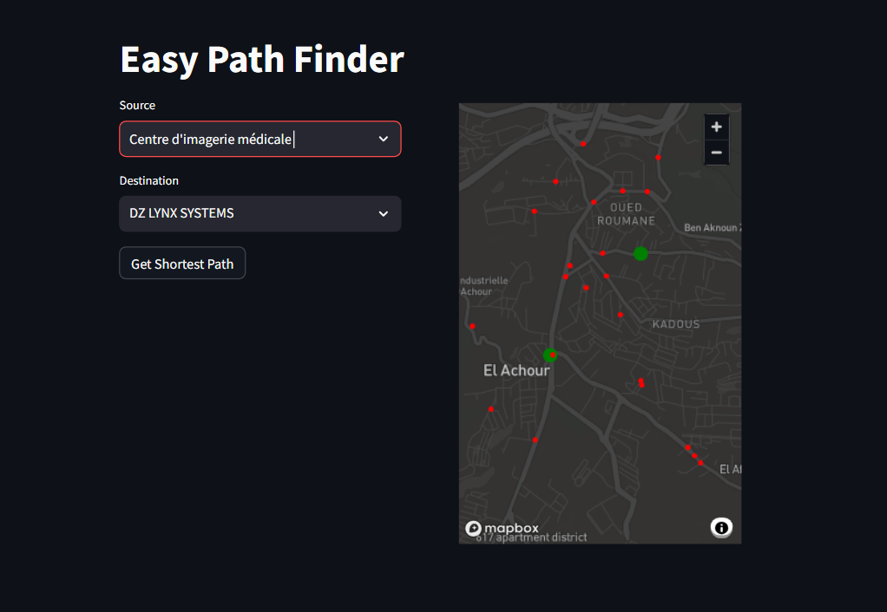
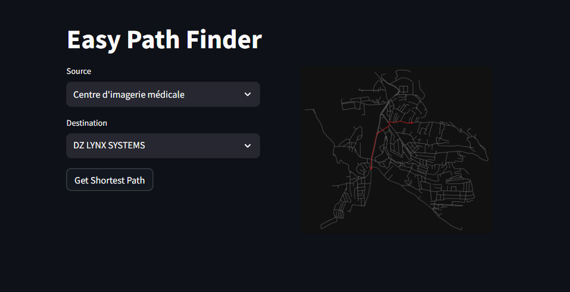

# Easy-Path-Finder [A Star Algorithem]

## Easy-Path-finder is A Web App built using Streamlit and A* Algorithem to find the shortest path between two points in a City , Currently it is only available for the city of el Achour, Algeries

## How to Use

- Select Two Places from the Select Box , and Click on the Find Path Button

## screenshots

## Packages Used

- Streamlit
- Pandas
- osmnx
- networkx
- geopy

## How to Run

- Clone the Repository

- Install the required packages

- Run the Streamlit App

## Contributors

- Any Contribution is welcomed

## Author

- Fares Bekkouche
